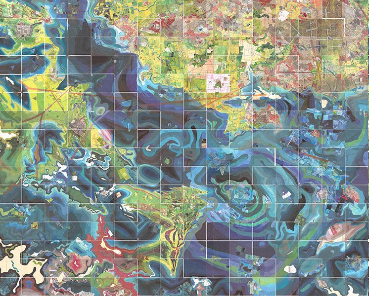

# Cartographie

## FRA2210-A2020

### Index

- [Cartographie subjective numérique](https://mmellet.github.io/Cartographie/FRA2210-A2020/AtCaSuNum.html#/)
  - [Cartographie subjective](https://mmellet.github.io/Cartographie/FRA2210-A2020/AtCaSuNum.html#/2) 
  - [Cartographie numérique](https://mmellet.github.io/Cartographie/FRA2210-A2020/AtCaSuNum.html#/10)
  

- [Atelier de cartographie subjective numérique de la *Carte du Tendre*](https://mmellet.github.io/Cartographie/FRA2210-A2020/AtCaSuNum.html#/14)

- [Documentation sur *StoryMapJS*](https://mmellet.github.io/Cartographie/FRA2210-A2020/AtCaSuNum.html#/19) 
